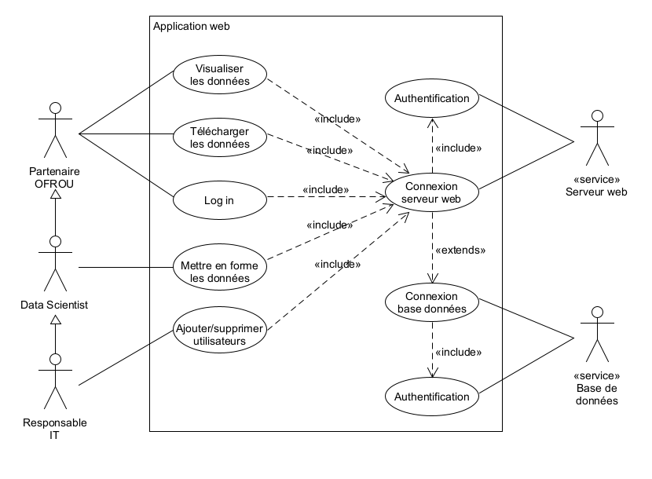
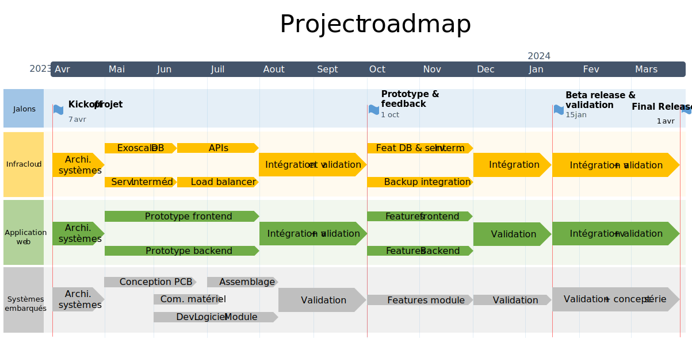

# Table des matières

1. [Introduction](#1-Introduction)
2. [Cadre du projet](#2-Cadre-du-projet)
3. [Besoins utilisateur](#3-Besoins-utilisateur)

   1. [Use case application web](#3.1-Use-case-application-web)
4. [Besoins fonctionnels](#4-Besoins-fonctionnels)
5. [Besoins non fonctionnels](#5-Besoins-non-fonctionnels)

   1. [Performance](#5.1-Performance)
   2. [Portabilité](#5.2-Portabilité)
   3. [Sécurité](#5.3-Sécurité)
   4. [Maintenabilité](#5.4-Maintenabilité)
   5. [Fiabilité](#5.5-Fiabilité)
   6. [Conformité](#5.6-Conformité)
   7. [Évolutivité](#5.7-Évolutivité)
6. [Roadmap, livrables et coût de développement](#6-Roadmap,-livrables-et-coût-de-développement)
	1. [Prototype](#7.1-Prototype)
	2. [Version Bêta](#7.2-Version-Bêta)
	3. [Version finale](#7.3-Version-finale)
	4. [Coût de développement](#7.4-Coût-de-développement)
   

# 1 Introduction

Ce document décrit le cahier des charges d'un projet d'amélioration de la sécurité routière. En effet, les situations dangereuses causées par les dépassements de véhicules de grande taille restent une cause d'accident fréquente. Le but de ce projet est de signaler la possibilité de dépassement aux automobilistes grâce à des signaux lumineux disposés à l'arrière des véhicules concernés. Dans ce document nous allons d'abord expliciter les besoins utilisateurs, puis nous mettrons en avant les besoins fonctionnels, les critères d'acceptation, les contraintes ainsi que les livrables à fournir lorsque le projet sera terminé. 

# 2 Cadre du projet

Le produit que nous décrivons dans ce cahier des charges devra permettre d'avertir un automobiliste (quel que soit son véhicule) lorsqu'un dépassement de grand véhicule est dangereux. Ce dispositif devra être actif lorsque les véhicules lourds sont sur la route, et si cette route est une route à deux sens. Nous excluons donc son utilisation sur les autoroutes et semi-autoroutes.

# 3 Besoins utilisateur

Cette section traite les besoins exprimés par les clients lors de l’élicitation et analyse du besoin.

| #    | Titre                                   | Besoin utilisateur                                           |
| ---- | --------------------------------------- | ------------------------------------------------------------ |
| 1    | Nombre de véhicules équipés             | Pour la fin de la première phase du projet, le client souhaite équiper 100 véhicules lourds avec le système de détection. Durant la phase suivante, le client souhaite équiper tous les véhicules lourds du canton de Vaud avec le système de détection (entre 1000 et 5000 véhicules) |
| 2    | Signalisation                           | Le signal de danger doit être affiché sous forme de pictogramme lumineux.  Le pictogramme doit pouvoir être vu et reconnu par le véhicule ayant l'intention de dépasser. Le pictogramme lumineux doit pouvoir être affiché grâce à un panneau lumineux situé à l'arrière du véhicule lourd. |
| 3    | Détection de danger                     | Les dépassements doivent être détectés sur toutes les routes Suisses comportant une voie en sens inverse. Le système ne doit donc pas détecter de dépassement dangereux sur les routes à double-voie unidirectionnelle (Autoroutes et semi-autoroutes). Le dispositif de signalisation doit signaler un danger lorsqu'il existe un risque de collision avec un autre véhicule venant en sens inverse. Le système doit pouvoir détecter tout type de véhicule dépassant et tout type de véhicule venant sur la voie opposée. |
| 4    | Installation du matériel                | L'installation du matériel sur le véhicule lourd doit être simple et réalisable par n'importe qui (chauffeur inclus). Si ce n'est pas possible et que le système est trop complexe a être installé, il doit être installé par le fournisseur du système. |
| 5    | Gestion des données                     | Les données collectées sur les véhicules, doivent être envoyées sur une base de donnée. Le logiciel de visualisation des données récupère ces dernières et les affiche. |
| 6    | Base de données                         | La base de données doit être hébergée dans le coud           |
| 7    | Traitement des données                  | Les données sont traitées par le client et par l'OFROU       |
| 8    | Disponibilité des données               | Les données sont ne doivent pas être mises à jour en temps réel sur la base de données. Le délai de mise à jour des données maximal est 12 heures. Le délai de mise à jour optimal souhaité est 1 heure. |
| 9    | Données utilisées                       | Les données collectées sur les véhicules sont:  1. La vitesse du véhicule sur lequel le système est installé 2. les coordonnées GPS 3. la date actuelle 4. l'heure actuelle  5. le nombre de dépassements dangereux 6. le nombre de véhicules détectés en face |
| 10   | Déploiement du système et conformité    | Dans le cadre de ce projet, le système sera déployé en Suisse uniquement. L'installation du dispositif de détection et du dispositif de signalisation doivent être conforme aux lois suisses. |
| 11   | Plateforme du logiciel de visualisation | Le logiciel de visualisation doit être une application web accessible depuis n'importe quel navigateur moderne. |
| 12   | Affichage des données                   | Les données doivent être affichées sous la forme de graphiques. |

## 3.1 Use case application web

# 4 Besoins fonctionnels

Cette section définit le système (Hardware et software) et ses composants. La liste des besoins fonctionnels est basée sur les besoins utilisateur et relève les fonctionnalités qu'il faut implémenter.

| #    | Titre                                       | Besoin fonctionnel                                           |
| ---- | ------------------------------------------- | ------------------------------------------------------------ |
| 1    | Identification de dépassement               | Le module de détection doit reconnaître chaque dépassement potentiellement dangereux, même si le véhicule à l'arrière n'effectue pas une manœuvre de dépassement. |
| 2    | Détection de véhicule arrière               | Le système de détection doit pouvoir détecter un véhicule roulant derrière le véhicule lourd. |
| 3    | Détection de véhicule avant                 | Le système de détection doit pouvoir détecter un véhicule venant en sens inverse. |
| 4    | Reconnaissance des routes                   | Le système de détection doit pouvoir différentier une route à double voie unidirectionnelle et une route à double sens. |
| 5    | Alimentation du système embarqué            | Le système de détection et le module de signalisation doit être alimenté par le système électrique du véhicule lourd uniquement. Aucune action de recharge manuelle ne doit être nécessaire. |
| 6    | Infrastructure cloud                        | Les données envoyées depuis les véhicules doivent être envoyées sur un serveur cloud intermédiaire avant d'être écrites dans la base de données. |
| 7    | Durée de vie des données                    | Les données déjà existantes dans la base de données ne changent pas dans le temps. |
| 8    | Connexion à la base de données              | Le logiciel de visualisation des données doit récupérer les données depuis la base de données. |
| 9    | Base de données                             | Le serveur intermédiaire et la base de données doivent être  hébergées chez un fournisseur cloud suisse (par exemple [Exoscale)](https://www.exoscale.com/dbaas/). |
| 10   | Backup base de données                      | Un backup de la base de données doit être mis en place.      |
| 11   | Exportation des données                     | Les données affichées sur l'application web doivent pouvoir être téléchargées au format CSV et JSON. |
| 12   | Serveur intermédiaire                       | Le serveur intermédiaire doit mettre en forme les données reçues et gérer les erreurs de connexions. |
| 13   | Identification des données                  | En plus des données utilisées pour visualisation et les statistiques un UUID, une indication de version du logiciel et la date de mise en service doit être envoyé au serveur intermédiaire. |
| 14   | Serveur application web                     | L'application de visualisation doit être servie depuis un serveur web hébergé dans le coud. |
| 15   | Clients web                                 | L'application web doit être affichées avec n’importe quel navigateur web basé sur chromium et Firefox. |
| 16   | Affichage des données sur l'application web | Chaque donnée (vitesse,  coordonnées,  nombre de dépassements, le nombre de véhicules détectés) doivent pouvoir être visualisée de manière indépendante sur un graphique en fonction du temps. |

# 5 Besoins non fonctionnels

Les besoins non-fonctionnels décrivent comment le système doit se comporter

## 5.1 Performance

1. Le serveur intermédiaire effectue les transactions dans la base de données de manière periodique, toutes les 60 minutes.
2. Le serveur web doit assurer un maximum de 10 connexions simultanées.
3. Le système embarqué n'envoie pas les données en temps réel au serveur intermédiaire
4. Le signal lumineux de danger doit être identifiable par un automobiliste roulant 100 mètres derrière le véhicule lourd au maximum.
5. Le système de détection doit pouvoir détecter un véhicule roulant derrière le véhicule lourd à une distance maximale de 50 mètres.
6. Le système de détection doit pouvoir détecter un véhicule venant en sens inverse à une distance maximale de 400 mètres.
7. Les données collectées sur les véhicules sont envoyées au serveur intermédiaire via une connexion aux données mobiles 3/4/5G.
8. La base de données est de type relationnelle.

## 5.2 Portabilité

1. Le système doit être compatible avec tout type de véhicule, puisque un des objectifs est de permettre d'être installé sur un groupe de véhicule lourd hétérogène.
2. Le système embarqué ne peut pas être installé par une personne non-formée (p. ex. chauffeur). Le système doit être installé par un technicien du fournisseur du système

## 5.3 Sécurité

### 5.3.1 Confidentialité

1. Les données envoyées depuis le système embarqué et par le serveur intermédiaire doivent être chiffrées et authentifiées.

2. L'accès à la base de données en lecture et écriture doit être chiffrée authentifiée.

3. La connexion au serveur web depuis le logiciel de visualisation doit être chiffrée authentifiée.
4. L'utilisation de l'application de visualisation nécessite une authentification.

### 5.3.2 Intégrité

1. Le système embarqué envoie les données sous forme de flux. La cohérence des données n'est pas garantie.
2. Le serveur intermédiaire ne doit envoyer uniquement des données cohérentes à la base de données.

### 5.3.3 Disponibilité

1. Le serveur intermédiaire, la base de données ainsi que le serveur web doivent être opérationnels de manière continues, sans interruption.
1. Les données doivent être disponible et accessibles par l'application de visualisation au minimum 10 ans après leur collecte.
1. Le backup de la base de données doit être effectué toutes les 24 heures.

## 5.4 Maintenabilité

1. Le dispositif doit être durable, avec des maintenance sur des grands intervalle planifiables à l'avance.
2. Les services de maintenance des systèmes doivent être averties 14 jours en avance au client.

## 5.5 Fiabilité

1. Le système de détection et le module de signalisation doivent être fonctionnels peu importe la situation météorologique et de la luminosité (nuit/jour).
2. Le système de détection et le dispositif lumineux doivent être opérationnels lorsque le véhicule lourd est en mouvement, et ce, jusqu'à son arrêt.

## 5.6 Conformité

1. Le système embarqué doit être certifié CE et homologué auprès de [l'OFROU.](https://www.astra.admin.ch/astra/fr/home/services/vehicules/homologation-des-vehicules.html)
2. L'ensemble des systèmes doivent être conformes à la [Loi sur la protection des données](https://fedlex.data.admin.ch/filestore/fedlex.data.admin.ch/eli/fga/2020/1998/fr/pdf-x/fedlex-data-admin-ch-eli-fga-2020-1998-fr-pdf-x.pdf) suisse.
3. Toutes les données du systèmes doivent être hébergées en suisse
4. Les matériaux et les composants du dispositifs doivent être durables et respectueux de l'environnement.

## 5.7 Évolutivité

1. Le système embarqué et la gestion du stock de composants doit être conçu de manière à être déployé sur, au minimum 5'000 véhicules.

2. L'application web doit être conçue de manière à supporter une augmentation du nombre d'utilisateurs (donc de trafic) dans les futures itérations du projet.

# 6 Roadmap, livrables et coût de développement

Le projet se déroule en 3 phase majeures, avec à chaque jalon des livrables spécifiques. à chaque jalon une démonstration est organisée avec le client ainsi qu'une évaluation des livrables et une validation. Chaque phase comporte une étape de validation. Cette étape de validation consiste à valider les requirements en interne, mais aussi avec le client sur plusieurs itérations successives.

## 7.1 Prototype

Le premier jalon consiste à créer un prototype du système global. Il comprend l'application web déployée et un système embarqué installé sur un ou plusieurs véhicules lourds. L'application web peut utiliser des données de tests si l'infrastructure cloud ou le système embarqué ne sont pas complètement fonctionnels. La démonstration client se déroule avec un prototype sur une route fermée.

Les livrable sont:

1. Mockup de l'application web
2. Prototype du hardware en kit.
3. Prototype de l'application web déployée et utilisable avec des données de test
4. Un rapport succinct de certains tests effectués sur route fermée.
5. Une démonstration client avec un prototype monté sur un véhicule lourd sur une route fermée.

## 7.2 Version Bêta

Les livrable sont:

1. description de l'architecture du système et de l'architecture cloud
2. Rapports de tests réalisés sur les prototypes et sur les unités de pré-production:
   1. Tests de fiabilité
   2. Tests  de performance
   3. Tests de comptabilité 
   4. Tests  de sécurité
3. Une version bêta de l'application web fonctionnelle
4. Une version bêta du hardware en plusieurs exemplaires
5. Une démonstration client avec la version bêta sur une route fermée

## 7.3 Version finale

Les livrable sont:

1. Un dossier technique complet selon exigences fixées par la législation de l'Union européenne applicables (CE) comportant:
   1. Une appréciation des risques
   2. Les plans mécaniques
   3. Les plans des circuits de commande
   4. La liste des directives et normes applicables
   5. Les instructions d'installation
   6. Une déclaration d'incorporation
2. Une documentation numérique de l'application web
3. Homologation du système embarqué
4. Rapport d'audit externe concernant la sécurité du système et des communications
5. Plan de maintenance et de support
6. Plan de déploiement de production en série
7. Supports de formation à l'utilisation de l'application web
8. Codes source de tous les software et middlewares déployés
9. 100 exemplaires fonctionnels du système de détection embarqué
10. La démonstration client avec plusieurs véhicules lourds sur route ouverte.

## 7.4 Coût de développement

Le coût de développement de ce projet s'élève à CHF 457'000.00.-

Ce prix ne prend pas en comptes plusieurs autres coûts, comme le prix du matériel électronique / mécanique pour la fabrication du système embarqué. De plus, les coûts de maintenance et de supports seraient aussi à ajouter au coût total du projet. Ces coûts supplémentaires seront calculés à la fin de la phase de prototypage, puis affiné à la fin de la phase bêta.
