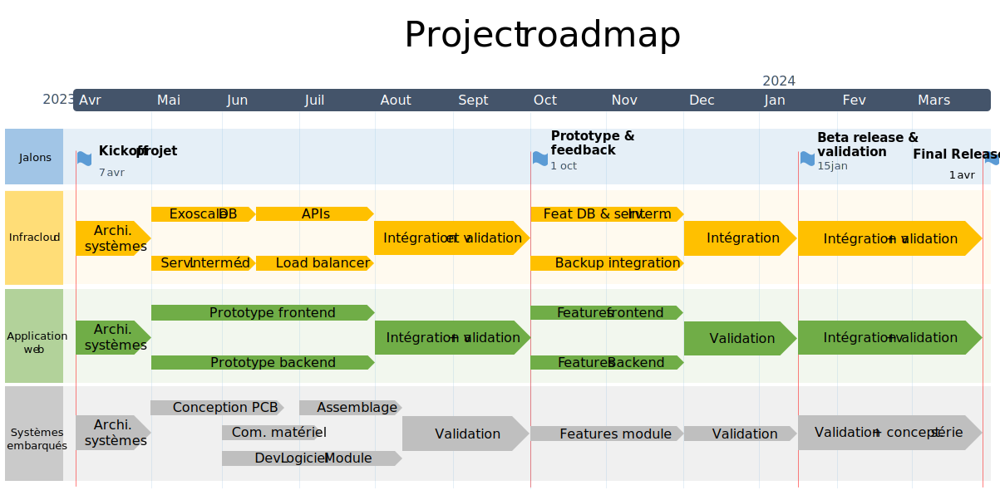

# Processus de développement

# 1 Introduction

Dans ce document nous allons expliciter le processus de développement qui nous semble le plus optimisé pour ce projet. Pour rappel, notre projet consiste en l'implémentation d'un dispositif de détection de possibilité de dépassement qui sera installé sur des véhicules de grande envergure (camion, tracteur, poids-lourd). Ce document va d'abord décrire les pratiques agriles et en cascade que nous avons choisies pour notre projet, ainsi que la façon dont elles seront mises en place aux seins des différentes équipes travaillant sur le projet. Ensuite nous allons présenter la roadmap de notre projet et les milestones importantes pour notre client. Ensuite, nous allons présenter nos personas avec une description détaille de leur métier, caractère, position par rapport au projet et buts. Finalement, nous allons estimer les coûts de développement en se basant sur l'estimation du temps de développement de chaque tâche en utilisant la méthode PERT.

# 2 Choix des pratiques agiles 

## 1. Tests automatisés

#### Description

La première pratique agile que nous souhaitons mettre en place en ce projet est d'utiliser des tests automatisés. Cette pratique nous vient directement de la méthode XP et nous semble pertinente dans le cadre de notre projet puisque nous avons trois types de spécialistes.

#### Pertinence et utilisation dans le projet

Puisque notre projet implique plusieurs équipes qui ne vont pas forcément communiquer pendant toutes les phases du projet. Le fait de discuter des résultats attendus entre les trois équipes puis implémenter des tests en conséquence permettra de minimiser la communication entre les équipes pendant les cycles de développement. 

## 2. Personas et user stories

#### Description

La deuxième pratique agile que nous allons mettre en place dans notre projet sera d'utiliser des personas et des stories ainsi que des scénarios.  Les personas seront décrites dans ce document alors que les user stories seront explicitées dans le backlog.  

#### Pertinence et utilisation dans le projet

Nous pensons que cette technique est pertinente pour avoir une vue d'ensemble des utilisateurices de notre produit. Qu'iels soient des utilisateurices finaux ou les personnes qui vont gérer ou utiliser l'application web et sa base de données. Grâce à cela nous serons sûrs de créer un produit qui répond à des attentes réelles.

## 3. SPRINT issu de la méthode SCRUM

#### Description

La troisième pratique agile est celle du sprint retrouvé dans la méthode SCRUM ainsi que les user stories et le backlog qui lui sont associés. Cette méthode pousse encore le concept de cycle de développement et permet aux managers d'avoir une vision d'ensemble et guider les équipes techniques de manière optimisée. 

#### Pertinence et utilisation dans le projet

Nous avons choisi d'implémenter des SPRINT pour nos équipes informatiques. Ce choix nous semble pertinent afin de permettre aux équipes de travailler de manière efficace avec les user stories. L'utilisation des SPRINT et leur fonctionnement dans le cadre de ce projet se décrite de plus ample manière dans le point suivant.

# 3 Processus de développement et roadmap

Pour ce projet, nous avons décidé de nous inspirer des méthodes agiles Extreme Programming ainsi que SCRUM sans pour autant complètement effacer les méthodes en cascades. En effet, l'approche globale de notre projet serait de manière distante en cascade. Nous avons donc une planification claire, avec des milestones importantes fixes dans le temps. Par contre, dans l'organisation en équipe, et pour des milestones moins importantes nous allons nous inspirer des méthodes agiles citées plus haut. 

Avant d'expliciter comment les méthodes choisies seront mises en place, nous allons décrire notre processus de manière plus globale, à savoir la manière dont les équipes interagissent entre elles et les liens entre le projet et le client. 
Tout d'abord, il faut savoir que notre équipe de production est composée de trois équipes distinctes. 

- l'équipe cloud
- l'équipe web
- l'équipe embarquée/électronique

Ces trois équipes se réuniront en début de projet afin de décrire leurs besoins concernant les interactions entre leurs système encadrés par leurs managers respectifs. Nous remarquons que cette étape n'est pas décrite dans notre roadmap puisque nous pensons que ce genre de détail ne concerne pas le client et la roadmap qui lui est dédiée est donc plus axée sur les milestones auxquelles il participera. Une fois cela fait, chaque équipe partira dans ce que nous nommerons la première itération de production qui consiste à définir les architectures de chaque système (voir roadmap ci-dessous). Il est important de noter que cette première étape est celle que nous choisissons comme première itération et que nous allons développer dans ce rendu. 

Concernant les milestones (qui sont donc reprises de la méthode en cascade), nous aurons trois milestones qui seront des rendez-vous avec le client pour voir si le projet correspond à ses attentes et lui montrer des prototypes tels que définis dans le cahier des charges. Nous avons donc la création d'un premier prototype de l'application, une version beta et la release finale du projet. 

Concernant l'implémentation des sprints, comme défini plus haut les drapeaux concernant les équipes informatiques sur la roadmap seront découpés en petites étapes (SPRINT) et les tâches concernant ces étapes seront prélevées dans le backlog des tâches (tirées des user stories). 

Un sprint durera entre 1 et 3 semaines selon l'état du projet. Par exemple, des sprints de 1 semaine peuvent être intéressants au début du projet pour rapidement avoir des fonctionnalités. Au contraire, une fois que le projet est bien en route et que les tâches risquent de prendre plus de temps les sprints pourront être rallongés et encore une fois se raccourcir vers la fin du projet quand il est essentiel que chaque changement soit intégré de manière optimale et sans risquer d'altérer la qualité de ce qui a déjà été produit. Nous avons fait le choix d'isoler les équipes durant les sprints afin qu'elles ne soient pas en collaboration constante mais puissent mettre leurs travaux en commun après chaque sprint pour des phases de test par exemple. Chaque phase de sprint sera organisée selon le modèle SCRUM et prendra en compte le choix des user stories à traiter et les tâches qui sont en lien, une phase de développement puis une phase de tests. 

Pour l'équipe embarquée, la conception se fera dans un mode classique en cascade puisque ces derniers sont dépendants des commandes de matériels. Malgré l'utilisation d'un modèle en cascade, l'équipe embarquée utilisera tous des mêmes des tests pour confirmer le bon fonctionnement du développement de son produit.

# 4 Personas

## 4.1 Hanna, CEO

Hanna Chapuis, CEO d'une entreprise de signalisation routière.

Après l'obtention d'un diplôme en génie mécanique, Hanna a rejoint une entreprise de signalisation routière où il a gravi les échelons d'un poste subalterne pour finalement devenir CEO. Sous sa direction, l'entreprise a connu une croissance importante, grâce à son accent sur l'innovation, la satisfaction de la clientèle et la qualité. Hanna croit fermement que la technologie peut jouer un rôle essentiel dans la réduction des accidents et des décès sur la route, et est à la recherche de nouvelles solutions et idées qui peuvent aider à atteindre cet objectif. En tant que CEO de son entreprise, Hanna est responsable de l'établissement de l'orientation stratégique, de la supervision des opérations quotidiennes et de la prise de décisions critiques qui ont un impact sur le rendement et la réputation de l'entreprise. C'est un leader fort qui valorise la collaboration et le travail d'équipe, ainsi que les méthodes de de développement agiles.

Hanna fait un appel d'offre concernant un dispositif IoT à installer sur les poids lourds et les engins agricoles, capable de détecter la présence de véhicules dans l’autre sens et d’afficher un message aux véhicules à l’arrière pour alerter en cas d’impossibilité de dépassement. Il collabore avec des partenaires de l'Office fédéral des routes, à qui il veut envoyer les statistiques basées sur les données récoltées. Cette collaboration vise à influencer la sphère politique de berne pour élaborer de nouvelles politiques et de nouveaux règlements visant à améliorer la sécurité routière. Cette collaboration lui permettra ainsi d'être le premier informé concernant les nouvelles législations, ainsi avoir un cran d'avance par rapport à ses concurrents.

Hanna est convaincu que les données récoltées doivent être hébergées dans le cloud. Il demande au prestataire de lui fournir une solution clé en main incluant toute l'infrastructure nécessaire, ainsi qu'une application web permettant à ses data scientists de générer des statistiques. Il emploie aussi un service informatique capable de gérer les comptes utilisateurs et remonter les bugs et les améliorations au prestataire de l'application web.

Dans un premier temps, Hanna veut équiper une centaine de véhicules permettant de valider la phase de tests. Dans un second temps, entre 1000 et 5000 véhicules seront équipés du dispositif.

### Buts:

1. Obtenir un appareil IoT fiable et efficace capable de détecter les situations de dépassement dangereuses et de collecter des données précises.
2. Collaborer avec l'Office fédéral des routes pour utiliser les données collectées afin d'influencer les politiques et les réglementations en matière de sécurité routière, ce qui peut profiter à son entreprise et à l'industrie dans son ensemble. 
3. Mettre en œuvre une solution basée sur le cloud pour stocker et gérer les données collectées et générer des statistiques pour analyse, ce qui peut aider son entreprise à prendre des décisions éclairées et à améliorer ses services.
4. S'assurer que la solution clé en main fournie par le fournisseur d'appareils IoT comprend toute l'infrastructure nécessaire, ainsi qu'une application Web conviviale pour l'analyse des données, afin de simplifier le processus et de réduire la charge de travail de son service informatique.
5. Étendre la mise en œuvre de l'appareil IoT au-delà de la phase de test initiale, en équipant des milliers de véhicules pour améliorer la sécurité routière et établir son entreprise en tant que leader de l'industrie.

## 4.2 Aria Data Analyst

Aria, Data Analyst, 28 ans

Aria est une data analyst de 28 ans travaillant pour une entreprise spécialisée dans l'analyse de données. Elle a obtenu un diplôme en statistiques et en analyse de données et a rejoint l'entreprise il y a deux ans. Aria est passionnée par son travail et adore trouver des modèles et des tendances cachées dans les données. Elle est convaincue que l'analyse de données peut aider à résoudre de nombreux problèmes dans le monde.

Aria est ravie d'apprendre qu'une entreprise envisage d'installer des dispositifs IoT sur les poids lourds et les engins agricoles pour améliorer la sécurité routière. Elle voit une opportunité unique de travailler sur un projet qui aura un impact réel sur la sécurité des gens. Aria sait que les données collectées par les dispositifs IoT seront cruciales pour comprendre les situations de dépassement dangereuses et pour développer des solutions pour améliorer la sécurité routière.

Aria est compétente dans l'utilisation de logiciels d'analyse de données tels que R et Python, ainsi que dans la manipulation de bases de données. Elle est impatiente de plonger dans les données collectées et de trouver des schémas intéressants. Elle estime que la collecte et l'analyse des données sont essentielles pour prendre des décisions éclairées et pour développer des solutions efficaces.

Aria est une fervente défenseure de l'utilisation de données brutes pour l'analyse, plutôt que de données nettoyées ou transformées. Elle croit que les données brutes sont les plus précieuses, car elles contiennent le plus d'informations possibles. Elle sait que le nettoyage des données peut entraîner la suppression de certaines informations importantes et qu'une transformation des données peut altérer la nature des données initiales. Elle préfère donc travailler avec des données brutes et s'assurer que toutes les informations collectées soient utilisées pour une analyse approfondie. Elle sait que cela peut prendre plus de temps et être plus difficile, mais elle estime que cela en vaut la peine pour obtenir des résultats plus précis et utiles.

Aria est une personne curieuse et perspicace qui aime poser des questions et découvrir des faits cachés dans les données. Elle est également une communicatrice efficace et sait comment expliquer des concepts complexes à des non-experts. Elle estime que l'analyse des données doit être accessible et compréhensible pour tous, et elle est déterminée à communiquer les résultats de manière claire et concise.

## 4.3 Chloé, ingénieure système

Chloé, 32 ans, ingénieure système.

Chloé est ingénieure système dans une entreprise de signalisation routière spécialisée dans la fourniture de solutions de sécurité pour l'industrie du transport. Elle est responsable de la gestion des comptes d'utilisateurs pour l'application Web personnalisée de l'entreprise, ainsi que de la collaboration avec l'entreprise externe qui fournit l'application pour identifier et corriger les bugs, et suggérer des améliorations. 

Chloé est une personne très soucieuse du détail et organisée avec de solides compétences en résolution de problèmes. Elle est titulaire d'un diplôme en informatique et a de l'expérience dans le travail avec des applications Web et des bases de données. Elle comprend l'importance d'assurer la sécurité de l'application Web et est toujours vigilante sur les risques potentiels de sécurité.

Chloé aime collaborer, notamment avec les autres membres des équipes d'ingénierie et de support interne de son entreprise. Elle est une excellente communicatrice et est toujours prête à aider à résoudre tous les problèmes qui surviennent. Chloé est également proactive et toujours à la recherche de moyens d'améliorer l'application Web et de la rendre plus conviviale pour les utilisateurs internes.

### Buts

1. S'assurer que la gestion des comptes utilisateurs est fluide : L'un des principaux objectifs de Chloé est de s'assurer que la gestion des comptes utilisateurs est transparente et efficace. Cela implique la gestion des comptes d'utilisateurs, la vérification des informations d'identification des utilisateurs et la fourniture d'une assistance aux utilisateurs qui rencontrent des problèmes avec leurs comptes.
2. Collaborer avec le fournisseur d'applications Web : Chloé travaille également en étroite collaboration avec l'entreprise qui fournit l'application Web pour s'assurer que les bugs ou les problèmes sont rapidement résolus. Elle collabore avec le fournisseur pour suggérer des améliorations et des mises à jour à l'application, ainsi que pour s'assurer que l'application répond aux besoins spécifiques de l'entreprise.
3. Assurer la sécurité et la confidentialité des données : Compte tenu de la nature sensible des données collectées par les appareils IoT, Chloé doit également s'assurer que l'application Web est sécurisée et que les données des utilisateurs restent privées. Cela implique de mettre en œuvre des mesures de sécurité appropriées, telles que le chiffrage et les contrôles d'accès, et de s'assurer que l'application est conforme aux réglementations pertinentes en matière de confidentialité des données.

## 4.4 Emma, manager à l'OFROU

Emma est une manager de 41 ans à l'Office Fédéral des routes. Elle est chargée de prendre des décisions sur les politiques et les lois qui ont une incidence sur la sécurité routière partout au pays. Emma est une professionnelle très motivée et soucieuse du détail, passionnée par l'amélioration de la sécurité routière et la réduction du nombre d'accidents sur les routes suisses.

Emma possède une formation en ingénierie de la circulation et une solide compréhension des aspects techniques de la sécurité routière. Elle passe une grande partie de son temps à examiner les données et les recherches liées à la sécurité routière, à analyser les tendances et à évaluer l'efficacité des politiques et des règlements actuels. Elle travaille en étroite collaboration avec d'autres décideurs du gouvernement pour élaborer de nouvelles politiques et de nouveaux règlements visant à améliorer la sécurité routière, et communique également avec le public et divers intervenants pour recueillir des commentaires et s'assurer que tout le monde est informé de tout changement qui pourrait les affecter.

Emma est une communicatrice confiante et efficace qui est capable d'articuler des concepts techniques complexes de manière claire et concise. Elle possède également une vision stratégique, et est capable d'équilibrer des priorités concurrentes et de prendre des décisions difficiles qui sont dans le meilleur intérêt du public. Emma est toujours à la recherche de nouvelles façons d'améliorer la sécurité routière et s'engage à rester à jour avec les dernières technologies et innovations qui peuvent être utiles pour atteindre cet objectif.

### Buts:

1. Améliorer les lois sur la sécurité routière : Elle cherche constamment des moyens d'améliorer les lois et règlements existants, ainsi que d'en élaborer de nouveaux pour répondre aux problèmes émergents liés à la sécurité routière. 
1. Réduire les accidents de la route: Elle comprend l'impact dévastateur que les accidents de la route peuvent avoir sur les individus et les communautés et s'engage à prendre des mesures pour les prévenir. 
1. Promouvoir la sensibilisation et l'éducation : Elle estime que l'éducation du public sur les pratiques de conduite sûres est essentielle pour réduire le nombre d'accidents sur les routes suisses. Elle travaille à l'élaboration et à la mise en œuvre de campagnes éducatives visant à sensibiliser et à promouvoir des habitudes de conduite plus sécuritaires auprès du grand public.

## 4.5 Georges, Technicien

Georges est un technicien de 29 ans qui travaille pour une entreprise spécialisée dans l'installation et la maintenance d'appareils IoT sur des poids lourds, tels que des camions, des bus et des tracteurs. Il est responsable de l'installation et de la mise en service des appareils IoT, en veillant à ce qu'ils soient correctement intégrés dans les véhicules et fonctionnent correctement. 

Georges est hautement qualifié dans les systèmes électriques et mécaniques, et a une compréhension approfondie du fonctionnement de la technologie IoT. Il est minutieux et méticuleux dans son travail, veillant à ce que chaque installation soit réalisée selon les normes les plus élevées. 

Georges aime les défis techniques de son travail et est toujours à la recherche de moyens d'améliorer les performances des appareils qu'il installe. Il est à l'aise de travailler de façon autonome ou en équipe, et est capable de communiquer des informations techniques claires et concises aux clients et collègues.

### Buts:

1. S'assurer que les appareils IoT sont installés correctement et fonctionnent correctement sur les poids lourds et les machines agricoles.
2. Identifier et dépanner tout problème technique survenant lors de l'installation et de la mise en service.
3. Obtenir des instructions claires et une formation sur la façon d'utiliser et de maintenir les appareils IoT.

## 4.6 Jeanne, agricultrice

Jeanne est agricultrice de 45 ans qui utilise souvent des engins agricoles pour travailler sur ses terres. Jeanne est une femme ayant des connaissances techniques pluridisciplinaires. En effet, c'est elle, et elle seule qui sait comment réparer les appareils agricoles de sa ferme. Elle apprécie la mécanique, mais préfère que ses appareils soient fiables et ne pas devoir avoir à les réparer. Elle doit parfois conduire sur des routes à grande circulation et les dépassements sont un moment souvent dangereux pour les autres usagers de ces routes. Une grande partie des véhicules que conduit Jeanne dans son activité professionnelle sont limités à 30 ou 40 km/h. De plus c'est souvent des engins lourds, long et larges.

A des multiples occasions, Jeanne a été confrontée à des conducteurs mécontent de devoir subir la présence de véhicule plus lents sur les routes rurales.

Jeanne pense qu'en équipant ses véhicules d'un système pourrait d'une part éviter des accidents et d'une autre part apaiser les esprits entre les différents utilisateurs des routes de campagne.

### Buts:

1. Réduire le nombre d'accidents impliquant ses véhicules sur la route en équipant ses véhicules d'un système capable d'alerter les autres conducteurs lorsqu'elle est sécuritaire ou dangereux de dépasser. 
2. Augmenter sa confiance et sa tranquillité d'esprit lorsqu'elle conduit sur des routes achalandées avec ses machines agricoles.
3. Réduire potentiellement les coûts d'assurance de ses machines agricoles en démontrant un engagement envers la sécurité et la réduction des risques.

## Marc, livreur

Marc est un livreur de 35 ans qui travaille pour une entreprise de livraison en Suisse. Il passe la plupart de son temps sur la route à livrer des colis à divers endroits du pays. Marc est un gars pratique qui préfère les méthodes traditionnelles de livraison et qui n'aime pas vraiment la technologie. Il a toujours travaillé avec des cartes et des plans papier pour naviguer sur les routes et estime que cela suffit pour faire le travail.

Marc ne voit pas l'intérêt d'installer un dispositif IoT sur son camion pour améliorer la sécurité routière. Il pense que cela ajouterait des coûts inutiles et des complications supplémentaires à son travail. Il estime que la sécurité routière devrait être améliorée par une meilleure formation des conducteurs et des règles de circulation plus strictes plutôt que par l'installation de dispositifs électroniques.

Marc est un gars travailleur et sérieux, mais il peut parfois être têtu et réfractaire au changement. Il se sent à l'aise avec les méthodes de travail traditionnelles et préfère les garder plutôt que de passer à quelque chose de nouveau et inconnu. Il estime que la sécurité routière est importante, mais il pense que les choses peuvent être améliorées sans avoir recours à la technologie.

### Buts:

1. Accomplir son travail de chauffeur-livreur efficacement et sans complications ou distractions inutiles.
2. Éviter les coûts ou responsabilités supplémentaires qui peuvent découler de l'installation d'un appareil IoT sur son camion.
3. Maintenir son indépendance et son contrôle sur son travail, et ne pas avoir à compter sur une technologie inconnue.

# 5 Récapitulatif des User Stories

| no   | User story                                                   |
| ---- | ------------------------------------------------------------ |
| 1    | En tant que Hanna Chapuis, je   veux que le projet soit fini dans une année, pour le mettre en oeuvre dans un   délai acceptable |
| 2    | En tant que Hanna Chapuis, je veux équiper 100 véhicules d'un   système de détection de dépassement dangereux, pour évaluer la viabilité du   projet à petite échelle |
| 3    | En tant que Hanna Chapuis, je veux étendre la mise en œuvre de   l'appareil IoT au-delà de la phase initiale, pour équiper des milliers de   véhicules lourds et établir mon entreprise en tant que leader de l'industrie |
| 4    | En tant que Hanna Chapuis, je veux qu'un signal lumineux soit   affiché à l'arrière d'un véhicule lourd lors d'un dépassement dangereux d'un   autre véhicule, pour que le véhicule dépassant soit averti du danger |
| 5    | En tant que Hanna Chapuis, je veux que le signal lumineux soit   affiché sous forme de pictogramme, pour que le signal soit compréhensible   pour le plus grand nombre d'usagers |
| 6    | En tant que Hanna Chapuis, je veux que les dépassements   dangereux soient avertis uniquement sur les routes avec une voie en sens   inverse, pour qu'il soit utile aux conducteurs uniquement sur les routes ou il   existe un danger |
| 7    | En tant que Hanna Chapuis, je veux que le système de détection   soit opérationnel à tout moment ou le véhicule lourd est en opération, pour   de ne pas mettre en danger les utilisateurs de la route basant leur confiance   sur cette nouvelle technologie |
| 8    | En tant que Hanna Chapuis, je veux stocker les données   envoyées par le système de détection dans le cloud, pour pouvoir mettre à   l'échelle l'infrastructure quand le projet prendra plus d'ampleur |
| 9    | En tant que Hanna Chapuis, je veux que la solution clé en main   fournie par le fournisseur d'appareils IoT comprenne toute l'infrastructure   nécessaire, pour réduire la charge de travail de mon service informatique |
| 10   | En tant que Hanna Chapuis, je veux que les données récoltées   soient chiffrées et anonymisées, pour ne pas pouvoir lier les données   personnelles des chauffeurs et réduire les possibilités de failles. |
| 11   | En tant que Hanna Chapuis, je veux avoir une application web   conviviale permettant de créer des statistiques, pour permettre aux data   analysts de l'entreprise de fournir des statistiques |
| 12   | En tant que Hanna Chapuis, je veux que la durée de vie des   données soit d'au minimum 10 ans, pour assurer des statistiques à long terme |
| 13   | En tant que Hanna Chapuis, je veux que les données récupérées   sur l'application web soient cohérentes et pas erronées, pour réduire la   dispersion ou le bruit dans les statistiques |
| 14   | En tant qu'Aria, je veux pourvoir exporter/importer les   données dans un format brut, pour effectuer son travail sur d'autres systèmes   d'analyse, des données non formattées |
| 15   | En tant qu'Aria, je veux que l'interface de l'application lui   permette de mettre en forme divers métriques sous forme de graphiques, pour   fournir une visualisation sur les métriques permettant de relever des   patterns intéressants |
| 16   | En tant que Chloé, je veux que l'interface de l'application   web me permette de gérer les utilisateurs et les droits, pour être efficace   dans mon travail |
| 17   | En tant que Chloé, je veux que l'application soit sûre, et   sans vulnérabilités, pour ne pas subir d'attaque informatique, avec tous les   risques qui en découlent |
| 18   | En tant que Chloé, je veux être formée sur la gestion des   utilisateurs de l'application, pour être efficace et ne pas perdre de temps   dans mon travail |
| 19   | En tant que Chloé, je veux avoir un canal de communication   avec le fournisseur de l'application, pour remonter les bugs et faire part   des améliorations à implémenter |
| 20   | En tant que Emma, je veux avoir accès aux données récoltées   sur les véhicules, pour identifier quelles sont les routes, ou les conditions   source d'accidents |
| 21   | En tant que Emma, je veux être certaine que le système   embarqué ne soit pas une source de danger sur les routes, pour que les autres   usagers soient protégés, et non mis en danger |
| 22   | En tant que Georges, je veux être formé au dépannage et à   l'installation du système de détection embarqué, pour être le plus efficace   possible dans mon travail |
| 23   | En tant que Georges, je veux avoir à disposition un manuel   complet de mise en service et de dépannage, pour ne pas devoir apprendre par   coeur tous les détails du système |
| 24   | En tant que Georges, je veux avoir à disposition un canal de   communication avec le fournisseur du système embarqué, pour être assisté en   cas de panne complexe |
| 25   | En tant que Jeanne, je veux avoir confiance dans la fiabilité   de l'appareil embarqué, pour augmenter ma tranquillité d'esprit quand je   conduis sur les routes avec mon tracteur |
| 26   | En tant que Jeanne, je veux être formée à la réparation et au   dépannage de l'appareil, pour que je sois apte à le réparer de manière   indépendante |
| 27   | En tant que Jeanne, je veux que mon assurance prenne en compte   l'utilisation d'un tel appareil, pour avoir une réduction de prime en   démontrant mon engagement dans la sécurité routière |
| 28   | En tant que Jeanne, je veux avoir des pièces de rechange, pour   ne pas être dépendante des livraisons pour réparer l'appareil, ce qui me   ferai perdre du temps |
| 29   | En tant que Marc, je veux ne pas être responsable de   l'installation et de la maintenance du dispositif de dépassement, pour   accomplir mon travail sans complications inutiles |
| 30   | En tant que Marc, je veux que les données de conduite ne   soient pas envoyées par le système de détection, pour que mes supérieurs   n'aient pas un droit de regard sur la manière dont je conduis |

# 6 Récapitulatif des tâches

 Task | Équipe | Optimiste | Réaliste | Pessimiste 
-- | -- | -- | -- | -- 
Assembler   les kits prototype du système embarqué | Embedded systems | 24 | 36 | 54 
Assembler les kits bêta du système embarqué | Embedded systems | 31 | 42 | 65 
Assembler les kits release du système embarqué | Embedded systems | 62 | 96 | 147 
Concevoir le plan de déploiement de production en série | Embedded systems | 15 | 20 | 30 
Organiser le concept de gestion des stocks et de disponibilité du système embarqué | Embedded systems | 13 | 20 | 25 
Recherche du hardware de transmission des données répondant aux exigences | Embedded systems | 31 | 42 | 62 
Commande du matériel | Embedded systems | 28 | 36 | 59 
Concevoir l'architecture électronique du système embarqué | Embedded systems | 30 | 42 | 58 
Concevoir l'architecture du logiciel du système embarqué | Embedded systems | 31 | 42 | 55 
Recherche et commande du hardware de détection répondant aux exigences | Embedded systems | 61 | 84 | 129 
Conception mécanique du système de détection | Embedded systems | 26 | 42 | 61 
Conception mécanique du module de signalisation | Embedded systems | 27 | 36 | 59 
Fabrication des pièces mécaniques | Embedded systems | 53 | 84 | 104 
Conception électronique du PCB du système central de détection | Embedded systems | 27 | 40 | 62 
Conception électronique du module de transmission des données | Embedded systems | 22 | 36 | 52 
Conception électronique du panneau d'affichage led RGB | Embedded systems | 30 | 42 | 65 
Conception électronique du module de détection des routes | Embedded systems | 26 | 36 | 57 
Conception électronique du module de détection de véhicule frontal | Embedded systems | 66 | 84 | 102 
Conception électronique du module de détection de véhicule arrière & de dépassement | Embedded systems | 23 | 36 | 61 
Conception électronique du système d'alimentation autonome | Embedded systems | 26 | 36 | 54 
Programmation / intégration du driver d'affichage de pictogramme | Embedded systems | 17 | 24 | 32 
Programmation de la brique communication avec le serveur intermédiaire | Embedded systems | 27 | 36 | 60 
Programmation / intégration du logiciel du système de détection central | Embedded systems | 56 | 72 | 92 
Conception du câblage lié à l'alternateur et la batterie du véhicule | Embedded systems | 18 | 24 | 29 
Homologuer le système embarqué | Embedded systems | 24 | 36 | 53 
Concevoir le dossier technique CE | Embedded systems | 62 | 84 | 142 
Écrire la procédure de mise en service pour techniciens | Embedded systems | 16 | 26 | 42 
Écrire la procédure de dépannage pour techniciens | Embedded systems | 16 | 24 | 34 
Organiser la formation des techniciens de mise en service | Embedded systems | 10 | 16 | 21 
Concevoir la plateforme de support pour les techniciens | Embedded systems | 11 | 16 | 20 
Organiser un service de piquet pour le support des techniciens | Embedded systems | 6 | 8 | 14 
Organiser les formation des particuliers | Embedded systems | 18 | 24 | 30 
Écrire un document de mise en service pour les particuliers | Embedded systems | 20 | 32 | 42 
Écrire un document de dépannage pour les particuliers | Embedded systems | 15 | 24 | 29 
Concevoir le plan logistique pour la livraison de pièces détachées de rechange | Embedded systems | 6 | 8 | 13 
Élaborer les spécifications du protocole de communication entre le système embarqué et le serveur intermédiaire | Embedded systems | 17 | 24 | 36 
Comparer les offres IaaS suisses et choisir un fournisseur | Infra cloud | 16 | 24 | 33 
Mettre en place de load balancer du serveur intermédiaire | Infra cloud | 6 | 8 | 14 
Concevoir le schéma de la base de données | Infra cloud | 10 | 16 | 23 
Modélisation relationnelle de la base de données | Infra cloud | 18 | 24 | 39 
Implémentation des triggers et des fonctions de la base de données | Infra cloud | 17 | 24 | 36 
Implémenter le load balancer du serveur web | Infra cloud | 6 | 8 | 12 
Fournir les diagrammes de l'architecture cloud et des endpoints | Infra cloud | 11 | 16 | 22 
Mettre en place les back-up et snapshots de la base de données | Infra cloud | 5 | 8 | 10 
Mettre en place les back-up et snapshots du serveur intermédiaire | Infra cloud | 6 | 8 | 12 
Mettre en place le back-up et snapshots du serveur de l'application web | Infra cloud | 5 | 8 | 13 
Concevoir les mécanismes de contrôle d'intégrité des données du serveur intermédiaire | Infra cloud | 17 | 24 | 30 
Concevoir les mécanismes de contrôle d'intégrité de la base de données | Infra cloud | 15 | 24 | 31 
Tests de charge du serveur intermédiaire | Infra cloud | 5 | 8 | 12 
Tests de charge du serveur web | Infra cloud | 6 | 8 | 11 
Concevoir l'architecture logicielle du serveur intermédiaire | Application web | 11 | 16 | 25 
Développer le logiciel du serveur intermédiaire | Application web | 26 | 40 | 52 
Fournir les diagrammes de l'architecture software du serveur web | Application web | 10 | 16 | 26 
Fournir les diagrammes de l'architecture software du serveur intermédiaire | Application web | 11 | 16 | 25 
Concevoir le mockup de l'application web | Application web | 14 | 20 | 30 
Concevoir l'architecture du back-end de l'application web | Application web | 11 | 16 | 25 
Concevoir l'architecture du front-end de l'application web | Application web | 11 | 16 | 25 
Implémenter l'API du serveur web | Application web | 5 | 8 | 12 
Implémenter l'API du serveur intermédiaire | Application web | 5 | 8 | 13 
Développer le prototype front-end de l'application web | Application web | 52 | 66 | 86 
Développer le front-end de l'application web pour la version bêta | Application web | 59 | 84 | 109 
Améliorer le front-end bêta de l'application web pour la release | Application web | 99 | 150 | 183 
Programmer le module d'exportation en CSV et JSON dans le serveur de l'application web | Application web | 16 | 20 | 30 
Programmer les modules UI pour afficher les données sous forme de graphiques | Application web | 46 | 60 | 80 
Programmer la gestion des utilisateurs dans le serveur de l'application web | Application web | 28 | 40 | 63 
Mettre   en place le module d'authentification des utilisateurs | Application web | 20 | 30 | 40 
Programmer le dashboard administrateur | Application web | 15 | 20 | 25 
Organiser un audit externe de l'application web | Application web | 7 | 10 | 15 
Mettre en place un bug bounty ouvert concernant la sécurité du système complet | Application web | 28 | 42 | 53 
Organiser la formation des administrateurs de l'application web | Application web | 6 | 8 | 11 
Fournir une documentation d'utilisation du dashboard administrateur | Application web | 6 | 8 | 10 
Mettre en place une ligne de communication avec le client et un système de ticket   pour l'annonce de bugs | Application web | 11 | 16 | 19 
Développer le module de génération automatique de rapports statistiques | Application web | 28 | 42 | 69 
Fournir la documentation de la phase prototype | Tous | 23 | 36 | 59 
Fournir la documentation de la phase Bêta | Tous | 35 | 52 | 69 
Fournir la documentation de la phase release | Tous | 85 | 120 | 186 
Concevoir la démonstration avec le client de la phase prototype | Tous | 12 | 16 | 22 
Concevoir la démonstration avec le client de la phase bêta | Tous | 19 | 24 | 33 
Concevoir la démonstration avec le client de la phase release | Tous | 22 | 36 | 57 
Effectuer des tests du module embarqué sur route privée | Tous | 33 | 42 | 61 
Effectuer des tests du module embarqué sur route ouverte | Tous | 29 | 42 | 54 
Effectuer des tests de durabilité | Embedded systems | 12 | 16 | 23 
Effectuer des tests avec des véhicules agricoles | Tous | 12 | 16 | 22 
Présenter le système de détection aux assureurs | Tous | 12 | 16 | 26 

# 7 Estimation des heures avec PERT

| Déviation standard du projet | Temps réaliste total du projet |
| ---------------------------- | ------------------------------ |
| 47                           | 2786                           |

| Intervalles     | -           | +           |
| --------------- | ----------- | ----------- |
| 68.26% (+- 1SD) | 2739 heures | 2833 heures |
| 95.44% (+- 2SD) | 2692 heures | 2880 heures |
| 99.72% (+- 3SD) | 2645 heures | 2927 heures |

# 8 Estimation des coûts de développement

En prenant en compte un prix de 130.- par heure ingénieur, nous pouvons estimer le coût de développement du projet comme suit:

| Intervalles | -           | +           |
| ----------- | ----------- | ----------- |
| 68.26%      | CHF 356'070 | CHF 368'290 |
| 95.44%      | CHF 349'960 | CHF 374'400 |
| 99.72%      | CHF 343'850 | CHF 380'510 |

En prenant le pire cas, avec un intervalle de 99.72% et en appliquant une marge commerciale de 20% nous arrivons au montant de CHF 457'000.00.-

Ce prix ne prend pas en comptes plusieurs autres coûts, comme le prix du matériel électronique / mécanique pour fabriquer le système embarqué. De plus, les coûts de maintenance et de supports seraient aussi à ajouter au coût total du projet.
